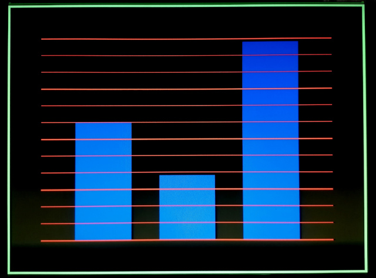
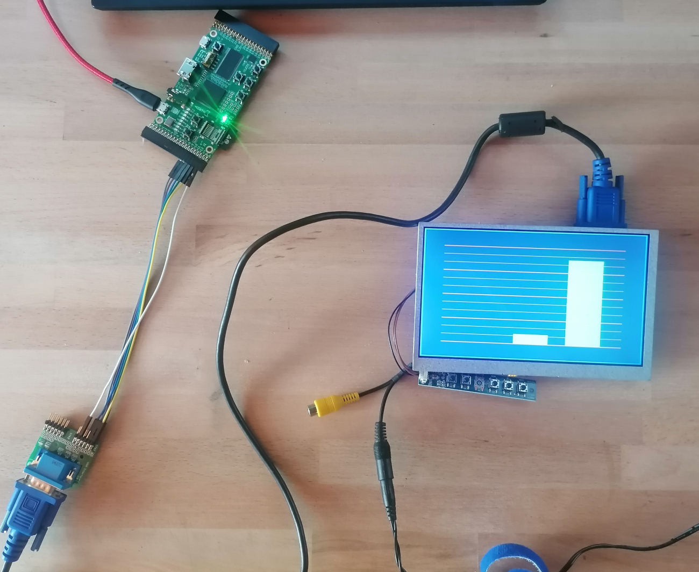

# vga_clock_1
Hardware circuit with an VGA output that displays a simple clock on the screen.

## Generate Verilog

```
cd spinalHDL
sbt run
```

Output is this Verilog file:
```
VgaClock.v
```

## Run the vga clock on an ULX3S 85k FPGA board

ToDo: Explain the following notes further

- Copy ```VgaClock.v``` into the folder ```ulx3s```
- cd ulx3s
- Get oss-cad-suite and unpack (https://github.com/YosysHQ/oss-cad-suite-build/releases)
- Set paths in makefile
- make
- make prog
- Connect pins to VGA display / VGA connector cable
  
  | VGA    | FPGA ULX3S   |
  |--------|--------|
  | red    | GN[9]  |
  | green  | GN[10] |
  | blue   | GN[11] |
  | H Sync | GN[12] |
  | V Sync | GN[13] |
  | GND | GND |

 
## VGA clock screen photo



## VGA clock drawing

This drawing might help to understand the pixel counter comparisons in the code.


## Photo of the build on my desk

